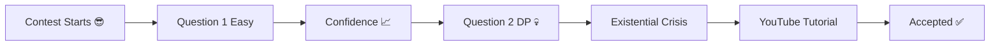

<h1 align="center">JAVA-ALGORITHMS ⚔️☕</h1>

<p align="center">
  
</p>

---

```java
public class Life {
    public static void main(String[] args) {

        while(alive){
            solveProblems();
            getWrongAnswer();
            debug();
            repeat();
        }
    }
}
```


## ⚡ Current Mental State

```text
Easy Problems       ██████████ 100%
Medium Problems     ███████░░░ 70%
Hard Problems       ██░░░░░░░░ 20%
Confidence          ████░░░░░░ 40%
Sanity              ░░░░░░░░░░ 0%
```

---

## 💀 Average Contest Experience



---

```text
Eat 🍕
Code 💻
Debug 🐛
Question Reality ❓
Sleep 😴
Repeat 🔁
```

---

## 🚀 Goal

> Turning caffeine into optimized solutions.

<p align="center">
  
</p>